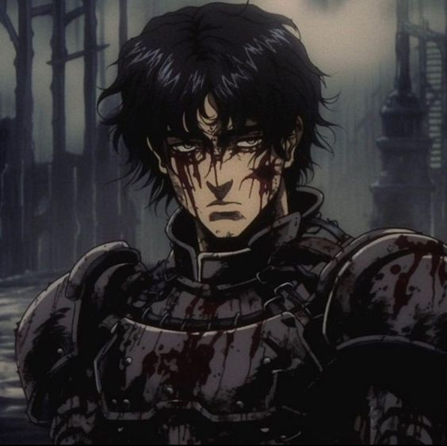

# **Hello! I'm evg1nn** 🦔

 <!-- Замените на ссылку на ваше изображение, если нужно -->

## Abaut me👨‍🎓

1. **I am a beginner developer**.
 - Passionate about the world of blockchain technologies.

2. **I strive to learn and master**:
- The principles of working with open source code.
- Code optimization.

3. **I enjoy participating in various projects on GitHub**.
- Looking for ways to contribute to projects.
- Working on improving code and documentation.

## 

## Связь со мной
- 📫 Электронная почта: [ваш.email@example.com](mailto:ваш.email@example.com)
- 🌐 [LinkedIn](https://www.linkedin.com/in/ваш-профиль) | [Twitter](https://twitter.com/ваш-профиль) 

<!---
evg1nn0eth/evg1nn0eth is a ✨ special ✨ repository because its `README.md` (this file) appears on your GitHub profile.
You can click the Preview link to take a look at your changes.
--->
